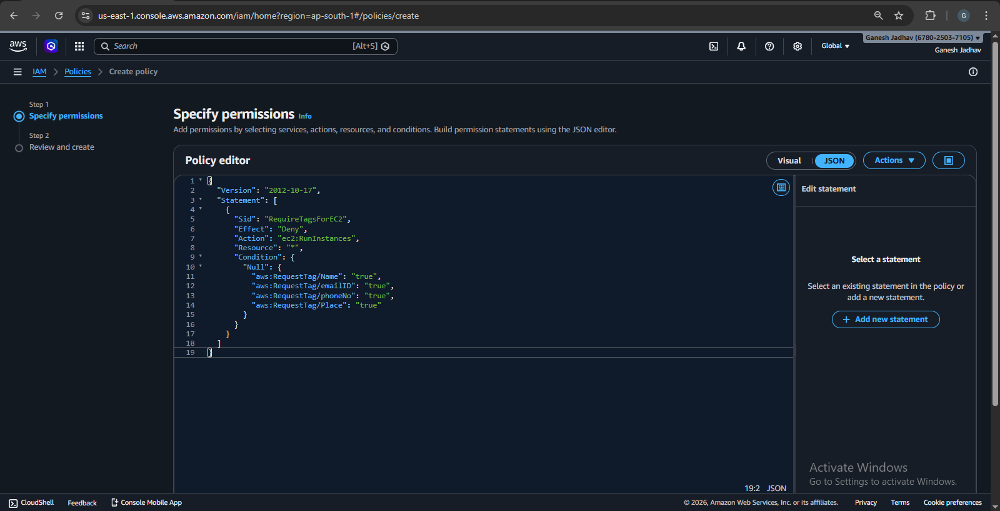
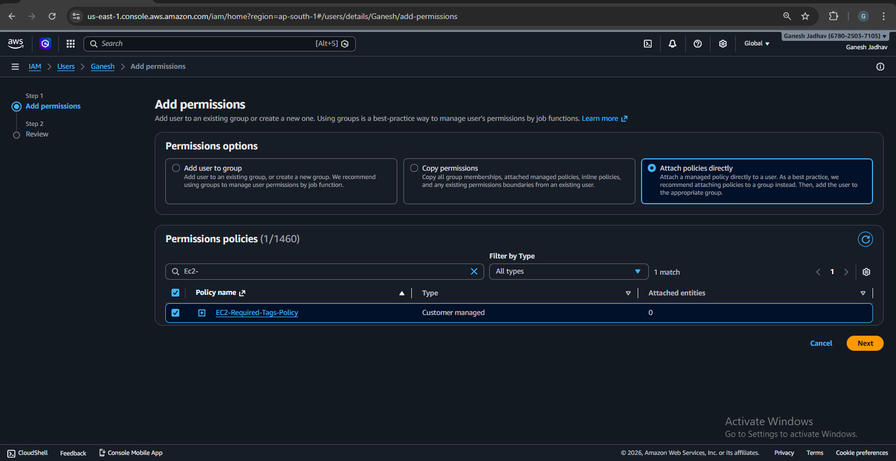
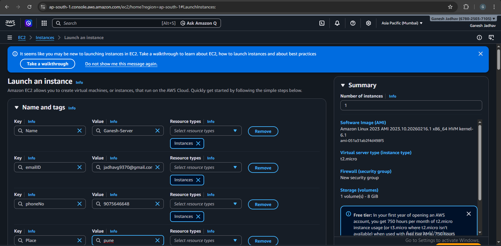
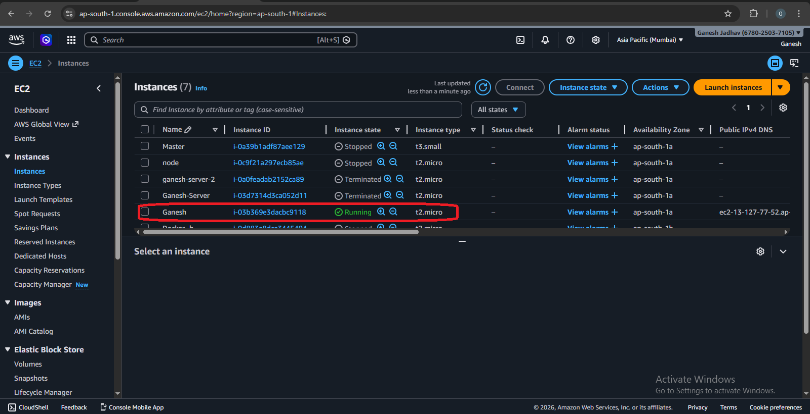
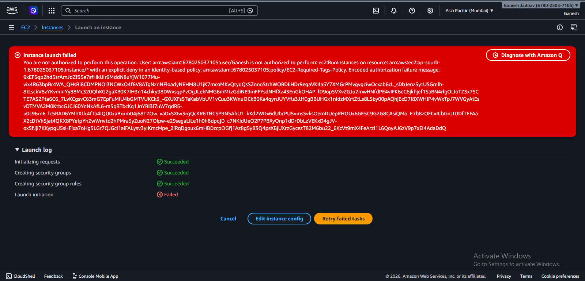

# EC2 Instance Launch with Enforced Tagging Policy Using AWS

## Project Overview

This project demonstrates how to enforce mandatory tagging for Amazon EC2 instances using AWS IAM policies. The purpose of this implementation is to ensure that every EC2 instance created in the AWS environment includes specific tags for identification, accountability, and resource management.

Tagging is an important best practice in cloud environments because it helps organizations track resources, manage costs, and maintain operational governance.

---

## Objective

The objectives of this project are:

- Understand AWS tagging best practices
- Enforce mandatory tags for EC2 instances
- Prevent instance creation when required tags are missing
- Demonstrate policy enforcement using IAM policies
- Document successful and failed instance launch scenarios

---

## Required Tags

Every EC2 instance must include the following tags during launch.

| Tag Key | Example Value |
|-------|--------------|
| Name | Ganesh |
| emailID | ganesh@gmail.com |
| phoneNo | 9876543210 |
| Place | Pune |

These tags help identify the resource owner and location.

---

## AWS Services Used

- AWS IAM (Identity and Access Management)
- Amazon EC2
- IAM Policies
- Tag-based access control

---

## Architecture / Concept

The project uses an IAM policy that denies the `ec2:RunInstances` action if required tags are not provided during instance creation.

Policy Logic:

- If required tags are present → Instance launches successfully
- If required tags are missing → Instance creation is denied


---

## Implementation Steps

### Step 1: Create IAM Policy

Navigate to:
```
AWS Console → IAM → Policies → Create Policy
```
**Add the following JSON policy:**

```


```json
{
  "Version": "2012-10-17",
  "Statement": [
    {
      "Sid": "RequireTagsForEC2",
      "Effect": "Deny",
      "Action": "ec2:RunInstances",
      "Resource": "*",
      "Condition": {
        "Null": {
          "aws:RequestTag/Name": "true",
          "aws:RequestTag/emailID": "true",
          "aws:RequestTag/phoneNo": "true",
          "aws:RequestTag/Place": "true"
        }
      }
    }
  ]
}
```
**Policy Name:**
```
EC2-Required-Tags-Policy
```
### Step 2: Attach Policy to IAM User

**Navigate to:**
```
IAM → Users → Ganesh → Add Permissions
```
**Attach:**

- *EC2-Required-Tags-Policy*

- *AmazonEC2FullAccess*

### Step 3: Login Using IAM User

Use the IAM user login URL and sign in with the user credentials.

### Step 4: Launch EC2 Instance with Required Tags

While launching the instance, add the required tags.

**Example:**
## User Details

| Key      | Value            |
|----------|------------------|
| Name     | Ganesh           |
| emailID  | ganesh@gmail.com |
| phoneNo  | 9876543210       |
| Place    | Pune             |

**Result:**

***Instance Launch Successful***

### Step 5: Attempt Launch Without Tags

Launch another EC2 instance but do not add tags.

**Result:**

***Instance launch failed***
***User is not authorized to perform ec2:RunInstances***

The IAM policy denies the request.

## Results

| Scenario                         | Result     |
|----------------------------------|------------|
| Launch EC2 with required tags    | Successful |
| Launch EC2 without tags          | Denied     |

The tagging policy enforcement works correctly.

## Screenshots

| No | Screenshot Name | Image |
|----|-----------------|-------|
| 1 | IAM Policy Creation |  |
| 2 | Policy Attached to IAM User | |
| 3 | EC2 Launch with Tags | |
| 4 | EC2 Launch Success with Tags | |
| 5 | EC2 Launch Failure without Tags | |

## Benefits of Tag Enforcement

- Better resource management  
- Cost allocation tracking  
- Resource ownership identification  
- Improved cloud governance  
- Automation and compliance support  

## Conclusion

This project demonstrates how AWS IAM policies enforce mandatory tagging during EC2 instance creation. Tag-based restrictions help maintain standardized tagging practices and improve visibility across cloud resources.

## Author

**Ganesh Jadhav**  
DevOps & AWS Intern  
Github: https://github.com/iam-ganeshjadhav  
Linkedin: https://www.linkedin.com/in/ganesh-jadhav-30813a267  
E-mailID: jadhavg9370@gmail.com   